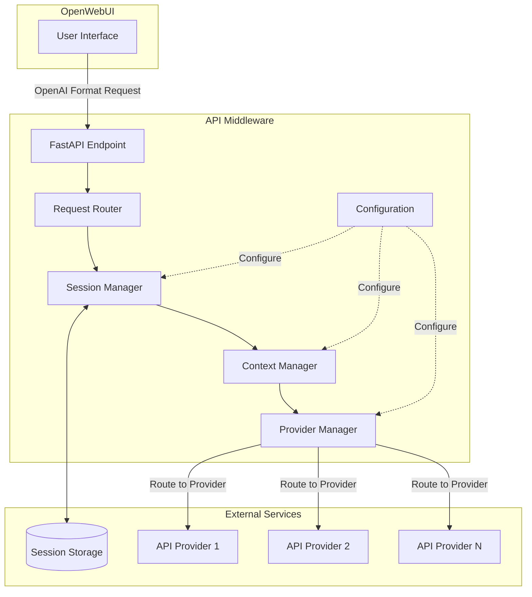

# Design Document: API Middleware Context Control

## Overview

The API Middleware Context Control system is a Python-based intermediary service that sits between OpenWebUI and multiple LLM API providers. It implements intelligent conversation context management to reduce token costs while maintaining conversation quality. The system exposes an OpenAI-compatible API endpoint, making it transparent to OpenWebUI.

**Technology Stack:**
- Language: Python 3.11+
- Web Framework: FastAPI (chosen for async support, automatic OpenAPI docs, and performance)
- Storage: In-memory with optional Redis for production
- Containerization: Docker
- Configuration: YAML + Environment Variables

**Key Design Principles:**
1. OpenAI API compatibility for seamless integration
2. Pluggable context reduction strategies
3. Provider-agnostic routing layer
4. Configuration-driven behavior
5. Stateless request handling with external session storage

## Architecture



**Request Flow:**
1. OpenWebUI sends chat completion request to middleware
2. Request Router validates and extracts session information
3. Session Manager retrieves/creates session context
4. Context Manager applies reduction strategies if needed
5. Provider Manager routes request to appropriate API provider
6. Response is returned to OpenWebUI in OpenAI format
7. Session Manager updates conversation history

## Components and Interfaces

### 1. FastAPI Application Layer

**Responsibility:** Expose OpenAI-compatible HTTP endpoints

**Endpoints:**
- `POST /v1/chat/completions` - Main chat completion endpoint
- `GET /v1/models` - List available models
- `GET /health` - Health check endpoint

**Request/Response Models (Pydantic):**

```python
class Message(BaseModel):
    role: str  # "system", "user", "assistant"
    content: str
    name: Optional[str] = None

class ChatCompletionRequest(BaseModel):
    model: str
    messages: List[Message]
    temperature: Optional[float] = 1.0
    max_tokens: Optional[int] = None
    stream: Optional[bool] = False
    # Additional OpenAI parameters...

class ChatCompletionResponse(BaseModel):
    id: str
    object: str = "chat.completion"
    created: int
    model: str
    choices: List[Choice]
    usage: Usage
```

### 2. Session Manager

**Responsibility:** Manage conversation sessions and their lifecycle

**Interface:**
```python
class SessionManager:
    async def get_session(self, session_id: str, user_id: str) -> Session
    async def update_session(self, session: Session) -> None
    async def reset_session(self, session_id: str) -> None
    async def add_message(self, session_id: str, message: Message) -> None
    async def get_context(self, session_id: str) -> List[Message]
```

**Session Data Model:**
```python
class Session:
    session_id: str
    user_id: str
    conversation_history: List[Message]
    memory_zone: List[str]  # Summarized important information
    metadata: Dict[str, Any]
    created_at: datetime
    updated_at: datetime
    total_tokens_used: int
```

**Storage Strategy:**
- Development: In-memory dictionary with TTL
- Production: Redis with session expiration
- Session key format: `session:{user_id}:{session_id}`

### 3. Context Manager

**Responsibility:** Apply context reduction strategies to control token usage

**Interface:**
```python
class ContextManager:
    async def apply_strategy(
        self, 
        messages: List[Message], 
        strategy: ContextStrategy
    ) -> Tuple[List[Message], Optional[str]]
    
    async def should_reduce(
        self, 
        messages: List[Message], 
        config: ContextConfig
    ) -> bool
    
    async def summarize_messages(
        self,
        messages: List[Message],
        summarization_model: str
    ) -> str
```

**Context Reduction Strategies:**

1. **Truncation Strategy:**
   - Remove oldest messages beyond configured limit
   - Always preserve system message
   - Keep last N turns of conversation

2. **Summarization Strategy:**
   - Call LLM to summarize old messages
   - Store summary in memory zone
   - Replace old messages with summary message

3. **Sliding Window Strategy:**
   - Keep recent N messages
   - Keep summary of older messages
   - Dynamically adjust window based on token count

**Configuration Model:**
```python
class ContextConfig:
    max_turns: int = 10
    max_tokens: int = 4000
    reduction_mode: str = "truncation"  # "truncation", "summarization", "sliding_window"
    summarization_model: Optional[str] = None
    preserve_system_message: bool = True
    memory_zone_enabled: bool = True
```

### 4. Provider Manager

**Responsibility:** Route requests to appropriate API providers and handle responses

**Interface:**
```python
class ProviderManager:
    async def route_request(
        self,
        model: str,
        messages: List[Message],
        **kwargs
    ) -> ChatCompletionResponse
    
    async def get_available_models(self) -> List[ModelInfo]
    
    async def resolve_model(self, model_name: str) -> Tuple[Provider, str]
```

**Provider Configuration:**
```python
class Provider:
    name: str
    base_url: str
    api_key: str
    provider_type: str = "openai"  # "openai", "azure", "custom"
    models: List[str]
    timeout: int = 30
    max_retries: int = 3
```

**Model Mapping:**
```python
class ModelMapping:
    display_name: str  # e.g., "proxyA/gpt-4"
    provider_name: str
    actual_model_name: str  # e.g., "gpt-4-0613"
    context_config: Optional[ContextConfig] = None
```

**Routing Logic:**
1. Parse model name for namespace (e.g., "proxyA/gpt-4")
2. Look up provider from namespace
3. Resolve actual model name
4. Forward request to provider's base_url
5. Handle provider-specific response formats

### 5. Configuration Manager

**Responsibility:** Load and manage system configuration

**Configuration File Structure (YAML):**
```yaml
system:
  port: 8000
  log_level: INFO
  session_ttl: 3600  # seconds

storage:
  type: redis  # "memory" or "redis"
  redis_url: redis://localhost:6379
  redis_db: 0

context:
  default_max_turns: 10
  default_max_tokens: 4000
  default_reduction_mode: truncation
  summarization_prompt: "Summarize the following conversation concisely..."

providers:
  - name: official
    base_url: https://api.openai.com/v1
    api_key: ${OPENAI_API_KEY}
    models:
      - gpt-4
      - gpt-3.5-turbo
  
  - name: proxyA
    base_url: https://proxy-a.example.com/v1
    api_key: ${PROXY_A_KEY}
    models:
      - gpt-4
      - claude-3

model_mappings:
  - display_name: official/gpt-4
    provider_name: official
    actual_model_name: gpt-4-0613
    context_config:
      max_turns: 15
      max_tokens: 6000
  
  - display_name: proxyA/gpt-4
    provider_name: proxyA
    actual_model_name: gpt-4
```

## Data Models

### Message Flow Data

```python
class Message:
    role: str  # "system", "user", "assistant"
    content: str
    name: Optional[str]
    timestamp: datetime

class ConversationHistory:
    messages: List[Message]
    total_tokens: int
    
    def add_message(self, message: Message) -> None
    def get_recent(self, n: int) -> List[Message]
    def estimate_tokens(self) -> int  # Rough estimation
```

### Session State

```python
class SessionState:
    active_messages: List[Message]  # Current context window
    memory_zone: List[str]  # Summarized history
    metadata: Dict[str, Any]
    
    def to_dict(self) -> dict
    @classmethod
    def from_dict(cls, data: dict) -> SessionState
```

### Provider Response

```python
class ProviderResponse:
    content: str
    model: str
    usage: TokenUsage
    finish_reason: str
    
class TokenUsage:
    prompt_tokens: int
    completion_tokens: int
    total_tokens: int
```

## Correctness Properties

*A property is a characteristic or behavior that should hold true across all valid executions of a system—essentially, a formal statement about what the system should do. Properties serve as the bridge between human-readable specifications and machine-verifiable correctness guarantees.*


### Property 1: Session Creation Uniqueness
*For any* new conversation request, creating a session should result in a unique session with both session_id and user_id populated.
**Validates: Requirements 1.1**

### Property 2: Message Append Preserves History
*For any* message and any existing session, appending the message should result in the message appearing in the session's conversation history.
**Validates: Requirements 1.2**

### Property 3: Context Reduction Triggers on Limit Exceeded
*For any* session where conversation history exceeds either the maximum turn limit or token budget threshold, the configured context reduction strategy should be triggered.
**Validates: Requirements 2.1, 2.2**

### Property 4: Session Storage Separation
*For any* session, the conversation history and memory zone should be stored separately such that operations on one do not affect the other.
**Validates: Requirements 1.4**

### Property 5: Session Reset Preserves Memory Zone
*For any* session, performing a reset operation should clear the conversation history while leaving the memory zone unchanged.
**Validates: Requirements 1.5**

### Property 6: Truncation Removes Oldest First
*For any* conversation history undergoing truncation, the earliest messages should be removed first while preserving the most recent messages.
**Validates: Requirements 2.3**

### Property 7: Summarization Reduces Token Count
*For any* conversation history undergoing summarization, the resulting summary should consume fewer tokens than the original messages.
**Validates: Requirements 2.4**

### Property 8: Summarization Calls Configured Model
*For any* summarization operation, an API call should be made to the configured summarization model.
**Validates: Requirements 2.5**

### Property 9: Context Reduction Stores Summary When Enabled
*For any* context reduction operation where memory zone is enabled, the generated summary should be stored in the session's memory zone.
**Validates: Requirements 2.6**

### Property 10: Priority Messages Preserved During Reduction
*For any* context reduction operation, messages marked as high priority (such as system messages) should be preserved in the resulting context.
**Validates: Requirements 2.7**

### Property 11: Model Routing Consistency
*For any* model request with a configured model name, the request should be routed to the provider specified in the model's configuration, and the correct actual model name should be used in the provider API call.
**Validates: Requirements 3.2, 3.3, 4.4**

### Property 12: Provider Error Handling
*For any* API request to an unavailable provider, the middleware should return an error response containing the provider status information.
**Validates: Requirements 3.4**

### Property 13: Model Name Mapping Consistency
*For any* configured model, the display name should consistently map to the same actual API model name across all requests.
**Validates: Requirements 4.1**

### Property 14: Namespace Parsing Correctness
*For any* model name in the format "provider/model-name", parsing should correctly extract the provider component and model component.
**Validates: Requirements 4.2**

### Property 15: Model List Completeness
*For any* request to the model list endpoint, the response should contain all models defined in the configuration with their display names.
**Validates: Requirements 4.3**

### Property 16: Namespace Configuration Sharing
*For any* group of models sharing the same namespace, they should inherit the same context strategy configuration.
**Validates: Requirements 4.5**

### Property 17: Configuration Hierarchy and Overrides
*For any* configuration parameter that exists at multiple levels (system, session, model) and has an environment variable override, the most specific level should take precedence, with environment variables overriding file-based values.
**Validates: Requirements 5.2, 5.3**

### Property 18: Invalid Configuration Fails Startup
*For any* invalid configuration (missing required fields, malformed values, or conflicting settings), the application startup should fail with a descriptive error message.
**Validates: Requirements 5.4**

### Property 19: OpenAI Format Compatibility
*For any* valid OpenAI-format chat completion request, the middleware should process it and return a response that conforms to the OpenAI response schema.
**Validates: Requirements 6.2, 6.3, 6.5**

### Property 20: Streaming Response Format
*For any* chat completion request with stream=true, the middleware should return responses in Server-Sent Events (SSE) format compatible with OpenAI's streaming protocol.
**Validates: Requirements 6.4**

### Property 21: Comprehensive Event Logging
*For any* significant system event (API call, context reduction, provider error), a log entry should be created in JSON format containing all required contextual fields (session_id, model, timestamp, token counts, error details as applicable).
**Validates: Requirements 7.1, 7.2, 7.3, 7.4, 7.5**

## Error Handling

### Error Categories

1. **Client Errors (4xx)**
   - Invalid request format
   - Missing required fields
   - Unknown model name
   - Invalid configuration

2. **Provider Errors (5xx from upstream)**
   - Provider API unavailable
   - Provider authentication failure
   - Provider rate limiting
   - Provider timeout

3. **System Errors (5xx from middleware)**
   - Session storage failure
   - Configuration error
   - Internal processing error

### Error Response Format

All errors follow OpenAI's error response schema:

```python
class ErrorResponse:
    error: ErrorDetail

class ErrorDetail:
    message: str
    type: str  # "invalid_request_error", "api_error", etc.
    param: Optional[str]
    code: Optional[str]
```

### Error Handling Strategies

1. **Provider Failures:**
   - Log error with full context
   - Return error to client with provider information
   - No automatic retry (client responsibility)

2. **Session Storage Failures:**
   - Log error
   - Return 503 Service Unavailable
   - Include retry-after header

3. **Context Reduction Failures:**
   - Log warning
   - Fall back to simple truncation
   - Continue processing request

4. **Configuration Errors:**
   - Fail fast on startup
   - Provide detailed error messages
   - Prevent service from starting

## Testing Strategy

### Unit Testing

Unit tests will verify specific examples and edge cases:

- **Session Management:** Test session creation, retrieval, update, and reset with specific session IDs
- **Context Reduction:** Test truncation and summarization with known message sets
- **Model Routing:** Test namespace parsing with specific model names
- **Configuration Loading:** Test loading valid and invalid configuration files
- **Error Handling:** Test specific error conditions and response formats

**Testing Framework:** pytest with pytest-asyncio for async tests

### Property-Based Testing

Property-based tests will verify universal properties across randomized inputs:

- **Minimum 100 iterations per property test**
- **Use Hypothesis library for Python**
- Each test tagged with: `# Feature: api-middleware-context-control, Property N: [property text]`

**Property Test Examples:**

1. **Session Creation (Property 1):**
   - Generate random user_ids and session_ids
   - Verify each creates a unique session

2. **Message Append (Property 2):**
   - Generate random messages and sessions
   - Verify messages appear in history after append

3. **Context Reduction Triggers (Property 3):**
   - Generate conversations of varying lengths
   - Verify reduction triggers when limits exceeded

4. **Namespace Parsing (Property 14):**
   - Generate random provider/model combinations
   - Verify correct parsing of components

5. **Configuration Hierarchy (Property 17):**
   - Generate random configuration combinations
   - Verify correct precedence rules

**Testing Framework:** Hypothesis for property-based testing

### Integration Testing

Integration tests will verify end-to-end flows:

- Complete request flow from API endpoint to provider and back
- Session persistence across multiple requests
- Context reduction in realistic conversation scenarios
- Multiple provider routing scenarios

**Testing Approach:**
- Use httpx for async HTTP testing
- Mock external provider APIs
- Use in-memory storage for fast tests

### Test Coverage Goals

- Unit test coverage: >80% for core logic
- Property tests: All 21 correctness properties implemented
- Integration tests: All major user flows covered

## Deployment Architecture

### Docker Container Structure

```dockerfile
FROM python:3.11-slim

WORKDIR /app

# Install dependencies
COPY requirements.txt .
RUN pip install --no-cache-dir -r requirements.txt

# Copy application code
COPY src/ ./src/
COPY config/ ./config/

# Expose API port
EXPOSE 8000

# Health check
HEALTHCHECK --interval=30s --timeout=3s --start-period=5s --retries=3 \
  CMD curl -f http://localhost:8000/health || exit 1

# Run application
CMD ["uvicorn", "src.main:app", "--host", "0.0.0.0", "--port", "8000"]
```

### Environment Variables

```bash
# Required
MIDDLEWARE_CONFIG_PATH=/app/config/config.yaml

# Optional (override config file)
MIDDLEWARE_PORT=8000
MIDDLEWARE_LOG_LEVEL=INFO
REDIS_URL=redis://redis:6379/0

# Provider API Keys (sensitive)
OPENAI_API_KEY=sk-...
PROXY_A_API_KEY=...
PROXY_B_API_KEY=...
```

### Docker Compose Example

```yaml
version: '3.8'

services:
  middleware:
    build: .
    ports:
      - "8000:8000"
    volumes:
      - ./config:/app/config:ro
    environment:
      - REDIS_URL=redis://redis:6379/0
      - OPENAI_API_KEY=${OPENAI_API_KEY}
    depends_on:
      - redis
    restart: unless-stopped

  redis:
    image: redis:7-alpine
    volumes:
      - redis_data:/data
    restart: unless-stopped

  openwebui:
    image: ghcr.io/open-webui/open-webui:main
    ports:
      - "3000:8080"
    environment:
      - OPENAI_API_BASE_URL=http://middleware:8000/v1
      - OPENAI_API_KEY=dummy  # Not used, but required by OpenWebUI
    depends_on:
      - middleware
    restart: unless-stopped

volumes:
  redis_data:
```

### Deployment Considerations

1. **Scalability:**
   - Stateless design allows horizontal scaling
   - Redis provides shared session storage
   - Load balancer can distribute requests

2. **Security:**
   - API keys stored in environment variables
   - No sensitive data in logs
   - HTTPS termination at load balancer

3. **Monitoring:**
   - JSON logs for centralized logging
   - Health check endpoint for orchestration
   - Metrics endpoint (future enhancement)

4. **Resource Requirements:**
   - CPU: 1-2 cores per instance
   - Memory: 512MB-1GB per instance
   - Storage: Minimal (logs only)
   - Redis: 256MB-512MB for session storage

## Implementation Notes

### Token Counting

Since exact token counting requires model-specific tokenizers, we'll use approximations:

- **Rough estimation:** 1 token ≈ 4 characters for English text
- **For production:** Integrate tiktoken library for OpenAI models
- **Configurable:** Allow per-model token counting strategies

### Summarization Prompt

Default summarization prompt template:

```
You are a conversation summarizer. Summarize the following conversation concisely, 
preserving key information, user intent, and important context. Keep the summary 
under {max_tokens} tokens.

Conversation:
{conversation_text}

Summary:
```

### Session TTL Strategy

- Default TTL: 1 hour of inactivity
- Configurable per deployment
- Automatic cleanup of expired sessions
- Warning logs for session expiration

### Provider Timeout Handling

- Default timeout: 30 seconds
- Configurable per provider
- No automatic retry (avoid duplicate requests)
- Clear timeout errors to client

## Future Enhancements

While not part of the initial implementation, these enhancements are considered for future versions:

1. **Advanced Routing:**
   - Cost-based routing
   - Performance-based routing
   - Automatic failover between providers

2. **Enhanced Monitoring:**
   - Web dashboard for metrics
   - Cost tracking and analysis
   - Usage analytics per user/model

3. **Multi-User Support:**
   - User authentication
   - Per-user quotas
   - User-specific configurations

4. **Advanced Context Strategies:**
   - Semantic similarity-based reduction
   - Entity extraction and preservation
   - Conversation topic segmentation

5. **Caching Layer:**
   - Response caching for identical requests
   - Embedding cache for semantic search
   - Provider response caching
